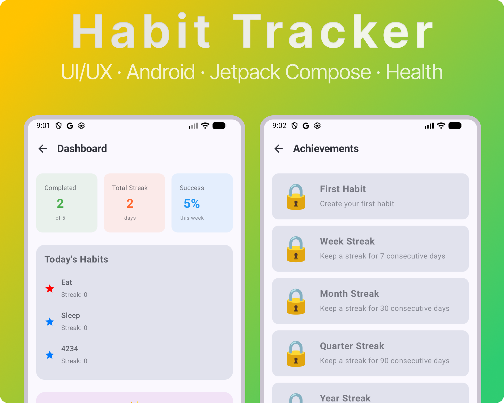

# Habit Tracker Android

An Android habit tracking application built with Jetpack Compose and modern Android development stack.



## 📱 About the App

Habit Tracker is a full-featured Android application for creating, tracking, and analyzing your habits. The app helps you build good habits and track your progress with statistics, visualizations, and gamification elements.

## ✨ Key Features

### Habit Management
- ✅ Create and edit habits with customizable goals
- 🎨 Custom icons and colors for each habit
- 📊 Track completion progress
- 📝 Support for habit categories
- 🔄 Support for various goal types (days per week, daily count, etc.)

### Statistics and Analytics
- 📈 Detailed statistics for each habit
- 📅 Progress calendar (heat map)
- 📊 Activity charts and graphs
- 🔍 Trend analysis and predictions
- ⏰ Statistics by time of day
- 📉 Period comparison

### Motivation
- 🏆 Achievement and rewards system
- 🎮 Gamification (points, levels, badges)
- 🔥 Streak tracking
- 🎯 Habit challenges
- 📋 Popular habit templates

### Organization
- 📁 Habit grouping
- 🔗 Habit triggers (if X, then Y)
- 📝 Weekly review
- 🎨 Beautiful modern interface

### Reminders
- 🔔 Customizable reminders
- ⏰ Flexible scheduling
- 📲 Push notifications

### Export and Backup
- 💾 Data export (CSV, JSON)
- 📤 Backup functionality
- 📅 Calendar export

## 🛠 Technologies

### Architecture
- **MVVM** (Model-View-ViewModel)
- **Clean Architecture** principles

### UI/UX
- **Jetpack Compose** - modern declarative UI
- **Material Design 3** - modern design system
- **Material Icons** - beautiful icons

### Data Storage
- **Room Database** - local database
- **Flow** - reactive data streams
- **Kotlin Coroutines** - asynchronous programming

### Dependencies
- Jetpack Compose
- Room Database
- ViewModel and LiveData
- Kotlin Coroutines
- Material Icons Extended
- Splash Screen API

## 📋 Requirements

- **Min SDK**: 24 (Android 7.0)
- **Target SDK**: 36
- **Kotlin**: 2.0+
- **Gradle**: 8.0+

## 🚀 Installation

1. Clone the repository:
```bash
git clone https://github.com/rafaelwww07-ios/HabitTrackerAndroid.git
cd HabitTrackerAndroid
```

2. Open the project in Android Studio (Hedgehog or newer)

3. Sync Gradle files

4. Run the app on an emulator or real device

## 📦 Building

To build a release version:

```bash
./gradlew assembleRelease
```

The APK file will be located in `app/build/outputs/apk/release/`

## 📁 Project Structure

```
app/
├── src/
│   ├── main/
│   │   ├── java/com/rafaelmukhametov/habittrackerandroid/
│   │   │   ├── data/              # Data layer
│   │   │   │   ├── database/      # Room database
│   │   │   │   ├── dao/           # Data Access Objects
│   │   │   │   ├── model/         # Entity models
│   │   │   │   └── repository/    # Repositories
│   │   │   ├── domain/            # Business logic
│   │   │   │   └── model/         # Domain models
│   │   │   ├── ui/                # UI layer
│   │   │   │   ├── screen/        # App screens
│   │   │   │   ├── theme/         # Theming
│   │   │   │   ├── util/          # UI utilities
│   │   │   │   └── viewmodel/     # ViewModels
│   │   │   └── service/           # Services (notifications, gamification)
│   │   └── res/                   # Resources
└── build.gradle.kts
```

## 🎨 Screenshots


*Dashboard and Achievements screens showcasing the app's modern UI*

## 🤝 Contributing

Contributions are welcome! Please feel free to submit a Pull Request.

## 📄 License

This project is licensed under the Apache License 2.0 - see the [LICENSE](LICENSE) file for details.

## 👤 Author

**Rafael Mukhametov**

## 🙏 Acknowledgments

- iOS version of HabitTracker app, which served as the foundation for this Android application
- Material Design for excellent design guidelines
- Android developer community

## 📝 Changelog

### Version 1.0
- Initial release
- All core habit tracking features
- Statistics and analytics
- Gamification
- Data export

---

⭐ If you like this project, please give it a star!
